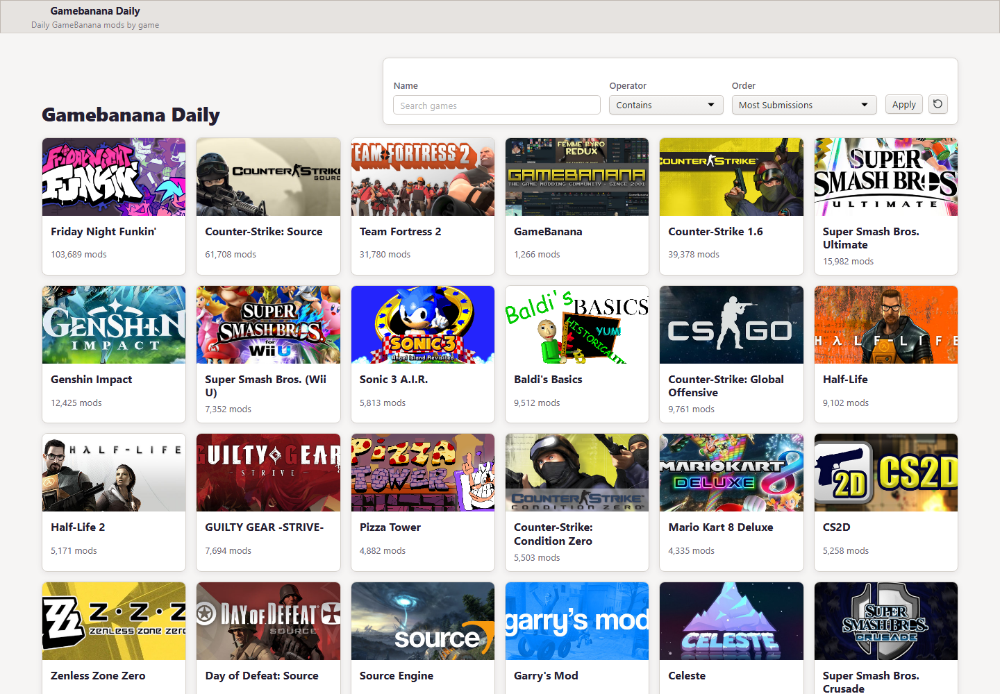
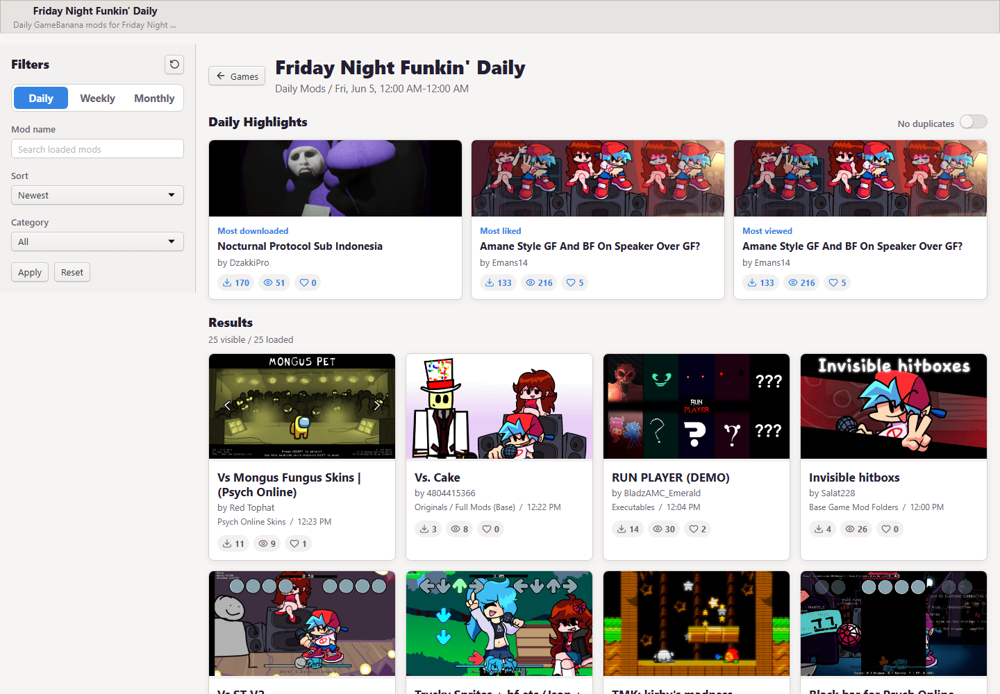

# GameBanana Today

Browse daily, weekly, and monthly GameBanana mods by game.

Live site: https://immalloy.github.io/gamebanana-today/

## What It Does

- Shows a searchable GameBanana game grid.
- Opens a game-specific mods feed.
- Supports Daily, Weekly, and Monthly ranges.
- Filters loaded mods by name, category, and sort mode.
- Highlights the most downloaded, liked, and viewed mods.
- Uses short shareable URLs like `?game=8694`.

## Dependencies

- React
- Vite
- TypeScript
- lucide-react
- web-toolkit

## Sources

- Game data and mod data: https://gamebanana.com/
- GameBanana API docs: https://github.com/GameBanana/GamebananaAPI-Docs

Made by Malloy: https://malloy.vercel.app/
